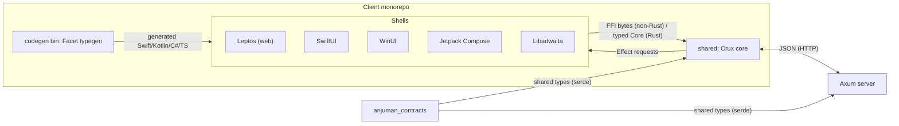
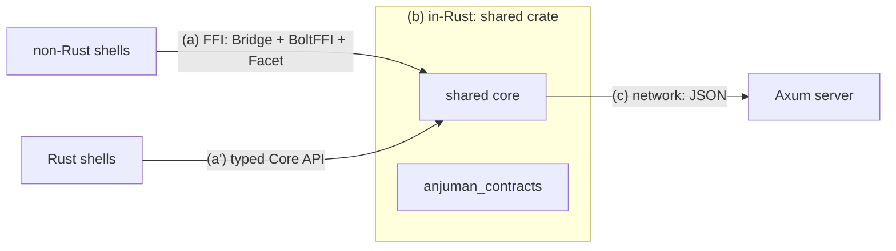

# Anjuman Architecture

An architecture overview for a Crux-based cross-platform application, written
in Rust end to end, with first-class native shells on five platforms and a
Rust web server.

> **Status:** living document. The Crux core + Leptos shell are implemented (a
> counter demo); the real domain (auth, decks, study) is stage-4 work. The
> server and `anjuman_contracts` now live in this monorepo (sibling folders) as
> separate Cargo workspaces linked by path dependencies.

---

## 1. Goals

- Share all business logic in a single Rust **core**, reused across every
  platform with zero duplication.
- Ship thin, idiomatic UIs: **SwiftUI**, **WinUI**, **Jetpack Compose**,
  **Libadwaita**, and a **Leptos** web shell for browsers.
- Back the client with a Rust **Axum** server that is currently the core's only
  consumer.
- Optimize the network boundary for the Rust↔Rust case (single consumer, both
  sides Rust).

## 2. Principles

- **Core-first, portable core.** The core has no knowledge of any UI. It is
  side-effect-free and implements an Elm-style architecture (`Model`, `Event`,
  `ViewModel`, `Effect`).
- **Thin shells.** Each shell renders the `ViewModel`, forwards `Event`s, and
  executes `Effect`s the core requests. All "what" lives in the core; only
  "how" (platform I/O) lives in the shell.
- **Single source of truth for the contract.** Types shared between the core and
  the server live in exactly one crate.
- **Rust-only where possible.** Because the only consumers today are Rust, we
  do not carry protobuf/OpenAPI ceremony; we use a Rust-native wire format.
- **Language-appropriate core access.** Rust shells drive the typed
  `Core<A>` API directly (no serialization); non-Rust shells cross the FFI
  boundary with generated `Bridge` + `BoltFFI` bindings.

## 3. Components



### 3.1 The Crux core (`shared/`)

- Implements `crux_core::App`.
- Defines `Model`, `Event`, `ViewModel`, and a `#[effect]` enum describing the
  side effects the shell must perform (at minimum `Render`; plus capabilities
  such as HTTP, key-value, and time as needed).
- **Two access paths**, used by different kinds of shell:
  - **Typed `Core<Anjuman>` API** — `process_event` / `view` / effect handling.
    Used by *Rust* shells (Leptos, Libadwaita), which can call the core
    directly with the typed `Event`/`ViewModel` types (no serialization).
  - **FFI `Bridge` surface** (`update`/`resolve`/`view`) annotated with
    `#[boltffi::export]`. Used by *non-Rust* shells (Swift/Kotlin/C#), where
    every value must cross the boundary as serialized bytes (`bincode`).
- Declares **capabilities** (the *specification* of a side effect). Each shell
  provides its own **implementation** of those capabilities in its native idiom.

### 3.2 Type generation (`shared/src/bin/codegen.rs`)

- A `codegen` binary inside the `shared` crate, enabled by the `codegen` feature.
- Uses `crux_core::type_generation::facet` to emit type declarations for
  **Swift**, **Kotlin**, **C#**, and **TypeScript**, so each native shell gets
  statically-checked `Event`/`ViewModel`/effect payload types.
- Lives alongside the core (rather than as a separate crate) so it can reference
  the `shared` types regardless of its `cdylib`/`staticlib` BoltFFI crate types.
- Emits into each shell's `generated/` directory (gitignored).

### 3.3 Shells (`shells/`)

| Shell | Language / framework | Style |
|---|---|---|
| `shells/leptos` | Rust + Leptos (`trunk`) | Native Rust shell (WASM) |
| `shells/swiftui` | Swift + SwiftUI | FFI shell (generated bindings + types) |
| `shells/winui` | C# + WinUI | FFI shell |
| `shells/jetpack-compose` | Kotlin + Jetpack Compose | FFI shell |
| `shells/libadwaita` | Rust + GTK4 / libadwaita (`gtk4-rs`) | Native Rust shell |

The **FFI shells** (SwiftUI, WinUI, Jetpack Compose) are driven through the
`Bridge` via generated bindings — they must, because their languages live outside
Rust and can only exchange bytes with the core. The **Rust shells** (Leptos,
Libadwaita) are *not* bound by that constraint: they drive the typed
`Core<Anjuman>` API directly (`process_event` / `view`), with no serialization,
no `Bridge`, and the real `Event`/`Effect`/`ViewModel` types. See §4 for the
boundary model and why these two paths differ.

### 3.4 The server (Axum)

- Lives in the **sibling `server/` folder** of this monorepo — a separate Cargo
  workspace, not a member of *this* (client) workspace, linked to the core via the
  path dependency on `anjuman_contracts`.
- Rust + Axum, exposing the HTTP API the core's HTTP capability calls.

### 3.5 The contract crate (`anjuman_contracts`)

- The **single source of truth** for the request/response types crossing the
  network between the core and the server. Lives in the sibling `contracts/`
  folder (a path dependency of both `server` and `client/shared`).
- Derived with **`serde`** (`Serialize`/`Deserialize`) only. It is deliberately
  **not** `Facet`-derived: keeping the wire DTOs serde-only avoids pulling `facet`
  (+ its `chrono`/`std` features) into the server (and its `openapi` feature
  stays the only gated dependency). Contract types therefore never appear *as
  fields* on the `ViewModel`/`Event`/`Effect` FFI enums.
- Fielding a wire type on the `ViewModel` instead goes through a **core-local
  view type** in `shared/src/app.rs` (e.g. `DeckSummary` ≅ `DeckResponse`,
  `StudyCardView`/`StudyCountsView` ≅ `StudyCard`/`StudyCounts`). The view type
  derives `Facet`/`PartialEq`/`Eq` and is built from the DTO in `Anjuman::view`.
- Consumed by the server (for handlers) and by `shared` (for the HTTP capability
  payloads and the model — where the DTO *is* used directly, since `Model` is
  serde-only and not `Facet`).

## 4. Boundaries

There are three distinct boundaries in the system. Understanding which tool
governs each is central to the design.

| Boundary | Between | Mechanism |
|---|---|---|
| **(a) FFI** | *non-Rust* shells ↔ core | Crux `Bridge` (bincode) + `BoltFFI` bindings + `Facet` typegen |
| **(a′) a typed call** | *Rust* shells ↔ core | in-process `Core<Anjuman>` API (`process_event` / `view`), no serialization |
| **(b) in-Rust** | core ↔ contract crate | compile-time; shared crate dependency |
| **(c) network** | core ↔ Axum server | JSON over HTTP (see §5) |

Boundary (a) and (a′) are the *same logical* boundary — a shell talking to the
core — but the mechanism diverges by shell language. Non-Rust shells (Swift,
Kotlin, C#) can only exchange bytes, so they use the serialized `Bridge` +
`BoltFFI`. Rust shells (Leptos, Libadwaita) hold the core in-process and call
its typed API directly, which is both simpler and faster.



### 4.1 What each tool is *not*

- **Crux/Facet/BoltFFI** handles boundary (a). It is the analog of `protoc` at
  the FFI layer. It does **not** define a network wire format.
- **`anjuman_contracts`** handles boundary (b) and defines the types used at (c).
  It is analogous to the *type-sharing* role protobuf plays, but it does not
  define a wire format or provide RPC, and it only works because both sides are
  Rust.
- **JSON** handles boundary (c) — the actual bytes on the network. Protobuf
  would only apply here, and only if non-Rust consumers or strict schema
  evolution were needed.

## 5. Network boundary design (core ↔ server)

The HTTP request is *performed by the shell* (via `crux_http`), which treats the
response body as opaque bytes and passes them to the core via `resolve()`. The
core — not the shell — deserializes the body. This matters because only one of
the five shells (Leptos) is Rust: the wire format must be one the *core* can
decode regardless of whether the shell that fetched it is Rust, Swift, Kotlin,
or C#.

### 5.1 Decisions

| Aspect | Decision |
|---|---|
| Wire format | **JSON** (the server sends JSON; `crux_http`'s `expect_json`/`body_json` default) |
| Shared types | **`anjuman_contracts`** crate (serde DTOs), single source of truth |
| Consumers | Any shell, any future language — the shell never parses the body |
| Future | Wire-format optimization (`rkyv`, protobuf, …) deferred until profiling justifies it — **TODO** |

### 5.2 Why JSON (and not `rkyv`)

- The server already sends JSON, and `crux_http` ships `expect_json`/`body_json`
  as its tested, documented path.
- `rkyv`'s advantage — zero-copy, Rust-native — is predicated on *both ends of
  the wire being plain Rust processes*. In Crux, the client end of the HTTP wire
  is the **shell**, which is only Rust for one of five targets (Leptos). The
  shell materializes the response into an owned buffer regardless, then the
  bytes re-cross a serialization boundary into the core; `rkyv`'s zero-copy
  mostly evaporates across that path.
- JSON keeps the wire readable by every shell and any future non-Rust consumer,
  so the shell never has to understand a Rust-only format.

### 5.3 Deferred: wire optimization

If, after profiling, JSON (de)serialization becomes a real bottleneck, the
options to revisit are:

- **`rkyv`** raw bodies: use `crux_http`'s raw-`Vec<u8>` mode, hand-roll
  `rkyv` (de)serialization in the core, and call `check_bytes` on untrusted
  inbound bytes.
- **protobuf/OpenAPI**: only if strict schema evolution or non-Rust *standalone*
  consumers (services other than this client) appear.

Either way, `anjuman_contracts` remains the single source of truth for the DTOs;
only the serializer pointed at `crux_http` changes.

### 5.4 Type flow

```
Server  --JSON bytes-->  shell (performs fetch)  --opaque bytes-->  core
  │                                                              │ deserialize (serde / expect_json)
  └─ (contract types)  ◄──────────────────────────────────────────┘
                                                                  ▼
                                                            Facet typegen
                                                                  ▼
                              Swift / Kotlin / C# / TS types for shells
```

The network bytes and the FFI bytes are independent; the *typed structs* in
`anjuman_contracts` are the shared layer between them.

## 6. Repository layout

This monorepo contains **three independent Cargo workspaces** (deliberately
separate — see the root `AGENTS.md`) linked by path dependencies:

```
contracts/                 # anjuman_contracts — shared wire DTOs (its own workspace)
server/                    # anjuman_server — Axum backend (its own workspace)
client/                    # this workspace
├── Cargo.toml              # [workspace] + [workspace.dependencies] (central pinning)
├── .gitignore
│
├── shared/                 # Crux core: Model/Event/ViewModel/Effect, App impl
├── shared/boltffi.toml     # BoltFFI targets (apple, android, wasm, csharp)
├── shared/src/bin/codegen.rs  # Facet typegen → Swift/Kotlin/C#/TS
│
└── shells/
    ├── leptos/             # Rust + Leptos (trunk)
    ├── swiftui/            # Xcode project (later)
    ├── winui/              # C# / WinUI project (later)
    ├── jetpack-compose/    # Kotlin / Android project (later)
    └── libadwaita/         # Rust + GTK4 / libadwaita (later)
```

Centralizing shared crate versions in `[workspace.dependencies]` avoids drift
across the multiple Rust crates. `client/shared` consumes `contracts/` via
`path = "../../contracts"`.

## 7. Why the client is a *separate workspace* from the server

Even though the server, contracts, and client now share one git repository, they
remain **separate Cargo workspaces**, not one top-level workspace:

- **No shared binary code.** The client and server share only the wire contract
  (`anjuman_contracts`), not compiled code.
- **Different release cadence.** The server deploys continuously; clients ship
  via App Store / Play Store / desktop installers on unrelated schedules.
- **Different dependency graphs / feature flags.** The client needs a WASM,
  size-optimized release profile and `facets`/`boltffi`; the server a standard
  throughput profile and a Postgres pool.
- **Unrelated toolchains.** FFI/typegen, `trunk`, Xcode, and Kotlin tooling have
  no place in a workspace that also builds a web server.

## 8. Distribution of decisions — settled vs. open

### Settled

- Crux core-first architecture with thin native shells (5 targets).
- **Two access paths**: typed `Core<Anjuman>` API for Rust shells (Leptos,
  Libadwaita); `Bridge` + `BoltFFI` bindings + `Facet` typegen for non-Rust
  shells (Swift/Kotlin/C#). Rust shells do *not* serialize through the FFI.
- Server + contracts live in this git repo as **sibling folders**, but each is a
  **separate Cargo workspace** (see §7).
- Single shared contract crate (`contracts/`) as the type source of truth.
- **JSON over the wire** for the core↔server boundary; wire-format optimization
  (`rkyv`, protobuf, …) deferred as a future TODO.
- **Contracts stay serde-only; the `ViewModel` uses core-local view types.** A
  wire DTO is never a `Facet` field of an FFI enum. `shared` maps DTO → view type
  (e.g. `DeckSummary` for `DeckResponse`, `StudyCardView`/`StudyCountsView` for
  `StudyCard`/`StudyCounts`) so `facet` stays out of `contracts`/the server. `Model`
  (serde-only) may hold the DTO directly.
- **Study loop is single-card + stateless** (US-4.5). `Model.current_card` holds
  one card; answering POSTs and replaces it with the response's `next_card`
  (`None` ⇒ "nothing due"). No client-side queue — mirrors the server's
  sessionless contract, so core state never drifts from server state.
- **Routing is core-owned, not per-shell.** The current route is `ViewModel`
  state — `selected_deck` plus the core-local `DeckView::{Study, Options}` enum
  exposed as `selected_deck_view`; shells forward `Event::OpenDeck`/
  `Event::OpenDeckOptions`, and the core chains `StartStudy`/
  `DeckOptionsRequested` and resets the route on `CloseDeck`. No `leptos_router`
  or URL routing — web-only tooling that would duplicate state the core already
  owns (and the four native shells can't share). See [`SHELLS.md`](./SHELLS.md) §3.
- Client workspace layout (workspace + `shared` + `shells/`).

### Open questions

1. **First capability set.** HTTP is required for stage 4; decide whether
   key-value + time are needed for the first features (auth token storage needs
   KV; learn-ahead/timebox are client-side but time-aware).
2. **Streaming/large payloads.** If large or streaming data is needed, decide
   between Server-Sent Events / chunked responses vs. single-message responses
   (the `counter-http` example demonstrates both HTTP and SSE effects).

## 9. Dependencies (reference)

> Pinned to versions verified at planning time; subject to change at
> implementation.

| Crate | Version | Role |
|---|---|---|
| `crux_core` | 0.20 | Core, `App`, `Bridge`, `render` capability |
| `crux_macros` | 0.10 | `#[effect]` macro |
| `serde` | 1.0 | Derives for FFI / JSON-capable types |
| `crux_http` | 0.20 | HTTP capability (the shell performs the request; `crux_http` describes it) |
| `facet` / `facet_generate` | (transitive via `crux_core`) | FFI type generation |
| `boltffi` / `boltffi_cli` | =0.30.1 | Native bindings generation (`#[boltffi::export]` + `boltffi.toml`) |
| `leptos` | latest | Web shell (WASM) |
| `gtk4` / `libadwaita` | latest | Linux shell (later) |
| `axum` | latest | Server (separate repo) |
